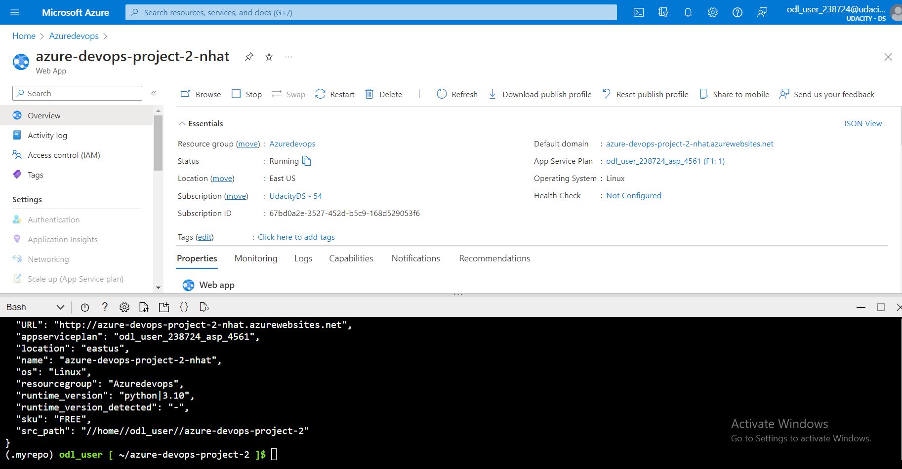
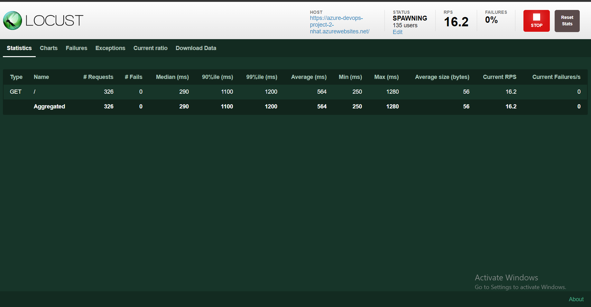

# Overview Of Udacity Azure Project 2

Hello, I am Nhat, this is project 2 has been created during the Nanodegree for DevOps Engineer using MS Azure on Udacity.

This project consists of flask application that is developed to predict housing prices in Boston (the model is already created by the instructor).
After planning the different steps regarding the deployment of a Python Flask Machine Learning app, we will manage to add GitHub Actions and Azure Pipeline to it to have a fully working CI/CD environment. 

This repositry demonstrate:
- Deploying the app in Azure CloudShell
- Deploying the app as a web server using Azure App Service.

If anything changed in it repository,  it will trigger the Github Action and also the Azure DevOps Pipelines to perform the CICD process and finally deploy to my app service.

## Badge

[](https://github.com/herrynhat/azure-devops-project-2/actions/workflows/pythonapp.yml)

## Project Plan
The planning tool I used are Trello Google Spreadsheets to keep track of the tasks and manage the project plan.

- [Trello](https://trello.com/b/YcFc1u1k/build-cicd-pipeline-for-azure-devops)

- [Spreadsheet](https://docs.google.com/spreadsheets/d/1DBxOIONEjgb9IKWU4g13gmGFElez7C8sp3p-by-qsBc/edit?usp=sharing)

## Instructions

Here is an architectural diagram:
Azure Cloud Shell


Azure CI


Azure CD


## Setup and Deploy the app in Azure Cloud Shell

In Azure Cloud Shell, clone the repo:
```
git clone git@github.com:herrynhat/azure-devops-project-2.git
```


Change into the new directory:
```
cd azure-devops-project2.1
```

Change to branch "ci-to-git-action"

```
git checkout ci-to-git-action
```

Create a virtual environment:
```
python3 -m venv ~/.myrepo
```

Activate the virtual environment:
```
source ~/.myrepo/bin/activate
```

Install dependencies in the virtual environment and run tests:
```
make all
```


Make change and test GitHub action


## Deploy the app to an Azure App Service

Create an App Service in Azure. 

Use this [file](./commands.sh) to create new App Services

```
az webapp up -n azure-devops-project2
```

Next, create the pipeline in Azure DevOps. The basic steps are:

- Go to [https://dev.azure.com](https://dev.azure.com) and sign in.
- Create a new private project.
- Create a new service connection to ARM, select subscription and the app service.
- Create a new pipeline linked to your GitHub repo using GiThub YAML File.

Screenshot of the App Service:



Screenshot of Azure DevOps Project:


To test the app running in Azure App Service, edit line 28 of the make_predict_azure_app.sh script with the DNS name of your app. Then run the script:
```
./make_predict_azure_app.sh 
```

If it's working you should see the following output:


You can also visit the URL of the App Service via the browser and you should see the following page:


View the app logs:

To view the log in Cloud Shell
```
az webapp log tail -g Azuredevops -n azure-devops-project-2-nhat
```


> 

## Load test

I use locust to perform load test on my local computer. 

Install locust:
```
pip install locust
```

Start load test:
```
locust -f locustfile.py --host https://azure-devops-project-2-nhat.azurewebsites.net/ --users 500 --spawn-rate 5 
```
Open a browser and go to [http://localhost:8089](http://localhost:8089) then click Start Swarming:





## Future Enhancements
- Creating a UI for making predictions.
- Adding test cases.
- Deploying my app with AKS.

## Demo 
Demo Video on Youtube 
[https://dev.azure.com](https://youtu.be/LM6cWs3EIXU)

